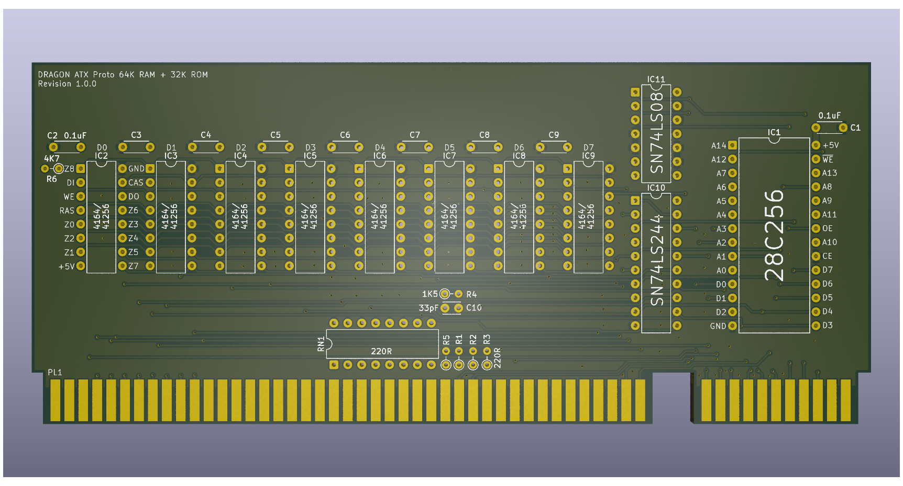

# Dragon 32 ATX Prototype RAM and ROM

This repository contains the KiCad project files
to produce the RAM and ROM component board for my
ATX Prototype backplane.

This design requires the ATX backplane board in order 
to operate
See https://github.com/jimbro1000/DragonATXProto

## Notes

Revision 1 of the board contains a design using 
conventional DRAM, either 64k or 256k. Revision 2 will 
use SRAM.

Revision 3 will contain just a Flash ROM for use with
the FPGA board on the backplane as this carries a
large volume of RAM onboard.

This design has been completed using KiCad 9. Earlier
versions of KiCad are not compatible.
